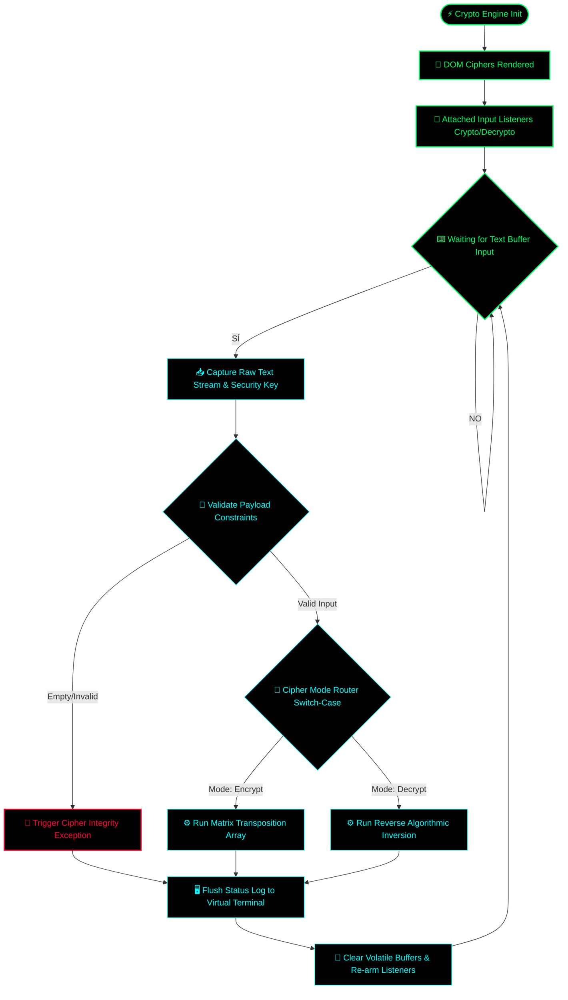

# Crypto Core Cipher Engine 🔐

A low-latency symmetric cryptographic processing engine built in native JavaScript. This repository demonstrates modular bitwise operations, character matrix transpositions, and real-time buffer encryption routines to secure localized data payloads with zero input lag.

## 🗂️ Architectural Overview

The cryptographic engine operates as a deterministic security pipeline, capturing raw text payloads, mapping string structures, and injecting transformational keys through a custom algorithmic substitution array.

### ⚙️ Core Technical Features:
* **Real-Time Data Ciphering:** Processes encryption and decryption loops instantly via localized memory stack routines.
* **Payload Integrity Protection:** Sanitize incoming data tokens to ensure zero memory corruption or buffer leaks.
* **Zero External Dependencies:** Built strictly with vanilla JavaScript, CSS, and HTML for direct hardware thread alignment.

## 🚀 Deployment Instructions

To run the cipher engine locally or host it on any web environment:
1. Clone this repository to your local storage.
2. Ensure `index.html`, `style.css`, and `script.js` are in the same directory.
3. Open `index.html` in any standard modern web browser (Chrome, Brave, Edge).

*Developed for cryptographic behavior analysis and core data protection logic prototyping.*

